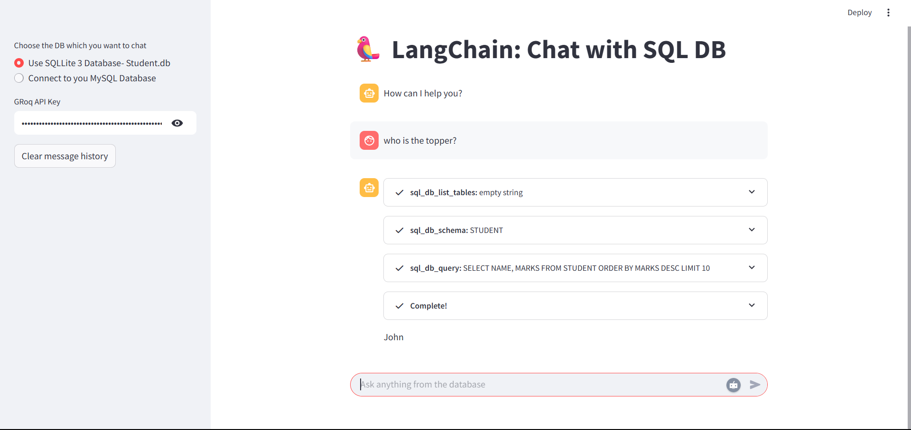

<p align="center">
  
</p>

<h1 align="center"> 🦜 LangChain-SQLChatAgent </h1>

> **A powerful, interactive SQL chatbot built using [LangChain](https://www.langchain.com/), [Streamlit](https://streamlit.io/), and [Groq](https://groq.com/) LLaMA3 models.** This tool enables users to communicate with relational databases (SQLite or MySQL) using natural language queries. Ideal for data analysts, developers, or educators who want a hands-free way to explore and interact with their databases.

---

## 🚀 Features

- 🔗 Connects to both **SQLite** and **MySQL** databases.
- 💬 Enables natural language querying using **Groq's LLaMA3-8B** model.
- 🧠 Uses **LangChain's SQL agent** and **toolkits** for dynamic SQL generation.
- 🖥️ Simple and elegant UI with **Streamlit**.
- 🔒 API key secured access and configurable MySQL credentials.

---

## 🧪 Demo Preview

<p align="center">
  
</p>

---

## 🏗️ Project Structure

```bash
LangChain-SQLChatAgent/
├── app.py # Main Streamlit application
├── sqlite.py # Script to create and populate a sample SQLite DB
├── student.db # SQLite database file (auto-generated)
├── requirements.txt # Python dependencies
├── assets/
│   ├── screenshot.png # Demo screenshot
│   └── social-preview.png # GitHub social preview banner
└── README.md # This file
```

---

## ⚙️ Installation & Setup

### 1. Clone the Repository

```bash
git clone https://github.com/Electrolight123/LangChain-SQLChatAgent.git
cd LangChain-SQLChatAgent
```

### 2. Install Dependencies

```bash
pip install -r requirements.txt
```

### 3. Generate Sample SQLite DB

```bash
python sqlite.py
```

### 4. Run the App

```bash
streamlit run app.py
```

---

## 🔐 API Key Setup

You'll need a **Groq API key** to use the LLaMA3 model. You can get one from [Groq Cloud]([https://console.groq.com/home]).
Paste it into the sidebar input field when prompted in the app.

---

## 📡 MySQL Configuration

If you want to use your own MySQL database:
- Choose "Connect to your MySQL Database" in the sidebar.
  - Provide:
  - Host
  - Username
  - Password
  - Database name
Make sure your DB is accessible and contains some data for querying.

---

## 🧠 Example Queries

- "List all students who scored more than 80."
- "How many students are in Data Science class?"
- "Show names of students in section A."

---

## 📌 Dependencies

`langchain`
`langchain_groq`
`streamlit`
`sqlalchemy`
`mysql-connector-python`
`python-dotenv`
`validators`

---

## 💡 Future Enhancements

- ✅ Add PostgreSQL support
- ✅ Add file upload for SQL dumps
- ✅ Improve response formatting
- ✅ Add export options for query results

---

## 📜 License
This project is licensed under the MIT License.

---

## 👨‍💻 Author
**Abhishek Bala**
B.Tech & M.tech @ NIT Rourkela
Feel free to connect on [LinkedIn]([https://www.linkedin.com/in/abhishek-bala-ba1ab224b/]) or check out more at [GitHub]([https://github.com/Electrolight123?tab=repositories])

---

## 🌟 Show Your Support
If you find this project useful, consider giving it a ⭐ and sharing it with your network!
